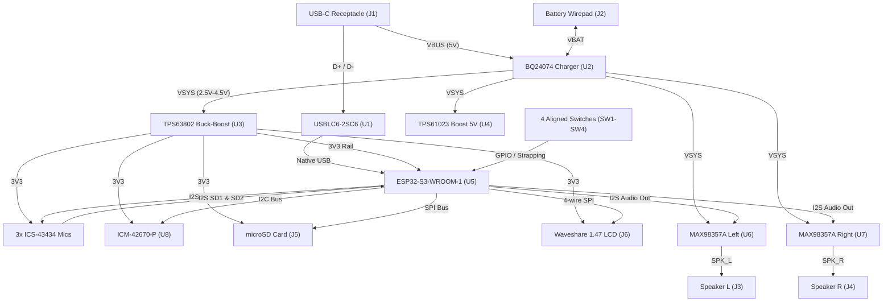

# Project Architecture — System Interconnect

```mermaid
graph TD
    USB["USB-C Receptacle (J1)"] -->|"VBUS (5V)"| CHG["BQ24074 Charger (U2)"]
    USB -->|"D+ / D-"| ESD["USBLC6-2SC6 (U1)"] -->|"Native USB"| MCU["ESP32-S3-WROOM-1 (U5)"]
    BAT["Battery Wirepad (J2)"] <-->|"VBAT"| CHG
    CHG -->|"VSYS (2.5V-4.5V)"| REG["TPS63802 Buck-Boost (U3)"]
    CHG -->|"VSYS"| BST["TPS61023 Boost 5V (U4)"]
    REG -->|"3V3 Rail"| MCU
    REG -->|"3V3"| MIC["3x ICS-43434 Mics"]
    REG -->|"3V3"| IMU["ICM-42670-P (U8)"]
    REG -->|"3V3"| SD["microSD Card (J5)"]
    REG -->|"3V3"| LCD["Waveshare 1.47 LCD (J6)"]
    CHG -->|"VSYS"| AMP1["MAX98357A Left (U6)"]
    CHG -->|"VSYS"| AMP2["MAX98357A Right (U7)"]
    MCU -->|"4-wire SPI"| LCD
    MCU -->|"SPI Bus"| SD
    MCU -->|"I2C Bus"| IMU
    MCU -->|"I2S Clocks"| MIC
    MIC -->|"I2S SD1 & SD2"| MCU
    MCU -->|"I2S Audio Out"| AMP1 -->|"SPK_L"| J3["Speaker L (J3)"]
    MCU -->|"I2S Audio Out"| AMP2 -->|"SPK_R"| J4["Speaker R (J4)"]
    SW["4 Aligned Switches (SW1-SW4)"] -->|"GPIO / Strapping"| MCU
```
